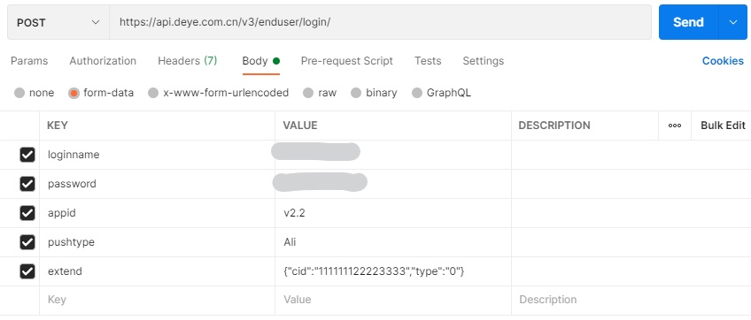
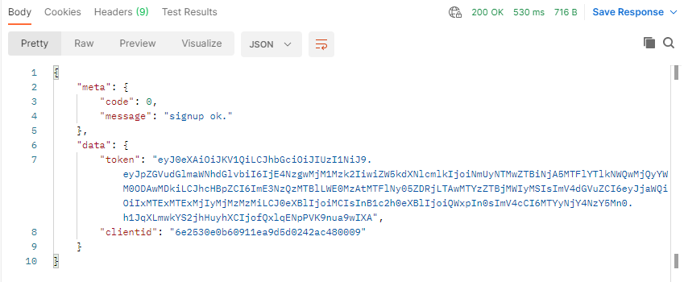
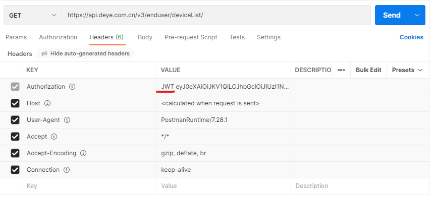
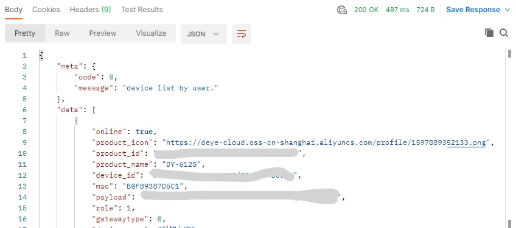
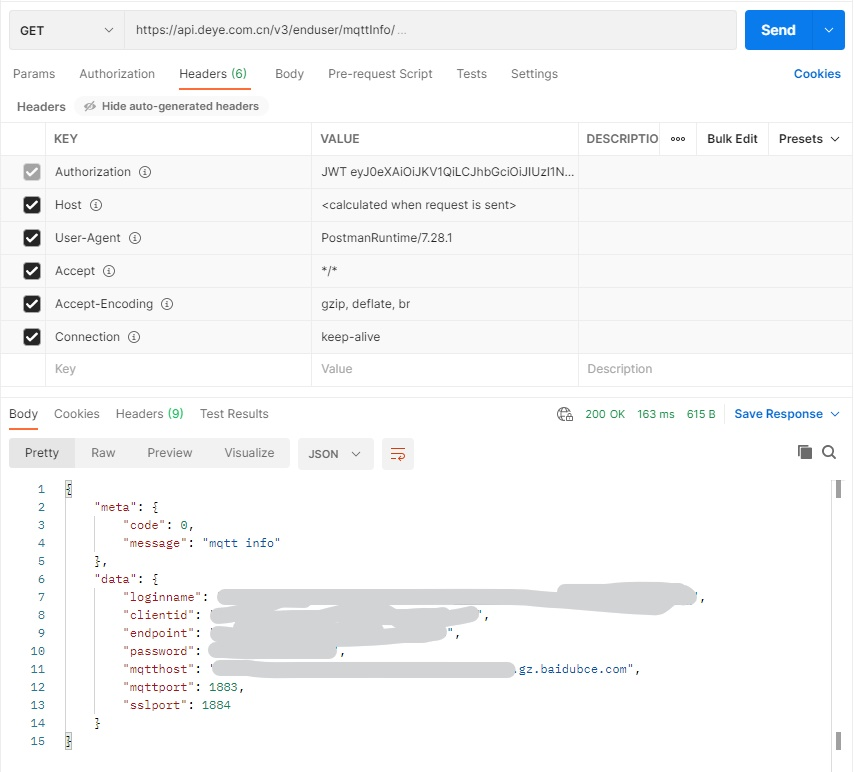

# 获取Token

使用postman发送post命令

获取响应中的token，待后续使用

# 获取设备列表

Authorization字段使用上一步中得到的token，注意前面要加"JWT "，得到product_id、device_id，待后续使用

​	

# 获取设备控制信息

Authorization字段使用上一步中得到的token，注意前面要加"JWT "，得到mqtt信息，待后续使用

# Reference

- [德业除湿机接入HomeAssistant](https://xiking.win/2020/11/12/3-deye-dehumidifer-add-to-homeassistant/)

